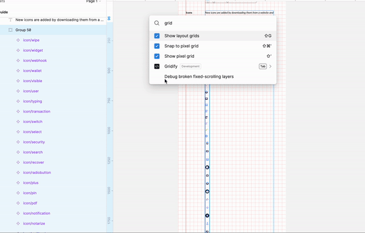

# Figma Gridify Plugin

Aligns child nodes on a grid. This is useful for creating icon libraries. Gridify uses the auto layout feature of Figma.

## Features
- Align items on a grid without positioning them manually.
- Easily update grids with new items. Just rerun the command.

## Usage

- Select the parent node containing randomly positioned items.
- Launch the plugin from the Figma console.
- Specify number of columns, spacing and width and hit run.